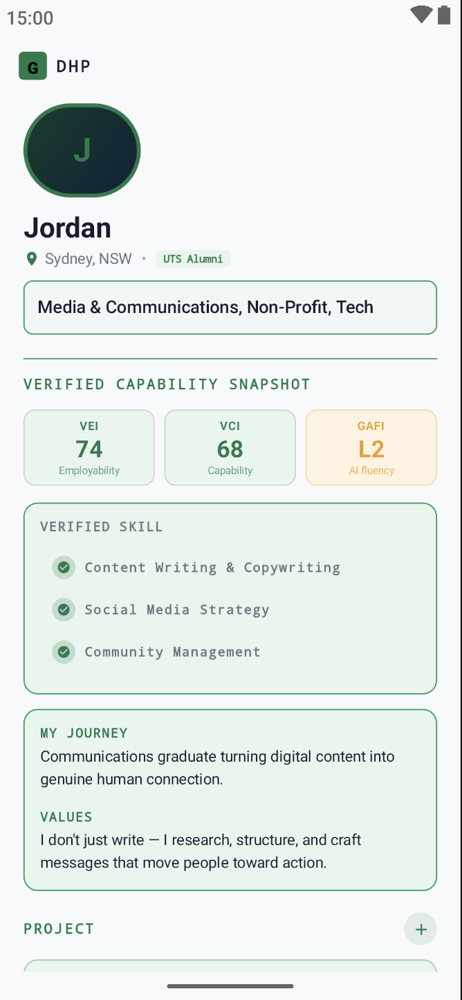
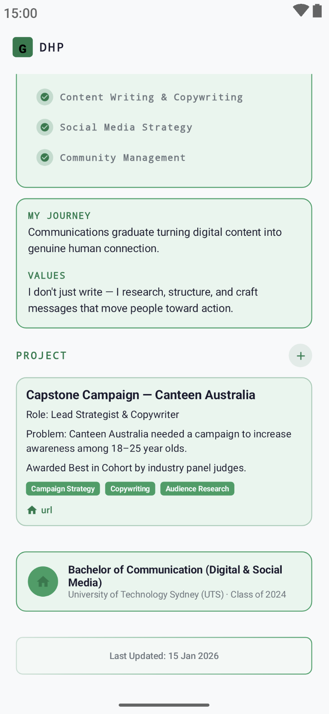

# Gradstack-Challenge

     
## Task 1
### 📍 Core Domain Model

`DhpModel.kt`

Path:  app/src/main/java/ai/gradstack/challenge/model/DhpModel.kt

---
## Task 2

### 📍 Main Screen
`ProfileScreen.kt`

Path:  app/src/main/java/ai/gradstack/challenge/ui/screens/ProfileScreen.kt

### 📸 Reference Screenshots

  
  

---
## Task 3

The core decision was to model the Digital Human Profile as a structured, layered data system rather than a flat resume-style object. This directly addresses Jordan's problem of feeling invisible because a resume can only show credentials and not capability. By separating identity, experience, projects, and quantified capability scores into distinct entities, each layer can be independently updated, verified, and used for matching.

I deliberately moved away from a resume-like hierarchy and instead structured the profile around scores, skills, and evidence. Verified signals like VEI, VCI, and GAFI are treated as first-class indicators and surfaced at the top of the UI so capability reads at a glance instead of requiring interpretation of a job title.

Given the time constraint, I injected mock data directly into the UI state rather than setting up a local database. With more time, I would separate the data layer cleanly from the presentation layer and introduce proper API contracts to support scalability and future team collaboration.
I also included benchmarkSector in the data model but left its logic unresolved. With a full team, I would work out how capability benchmarking maps to real industry standards before wiring it into the service.
